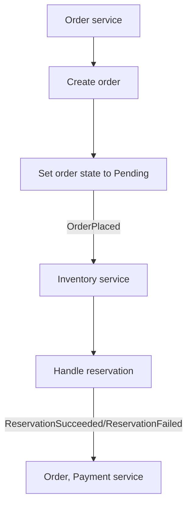
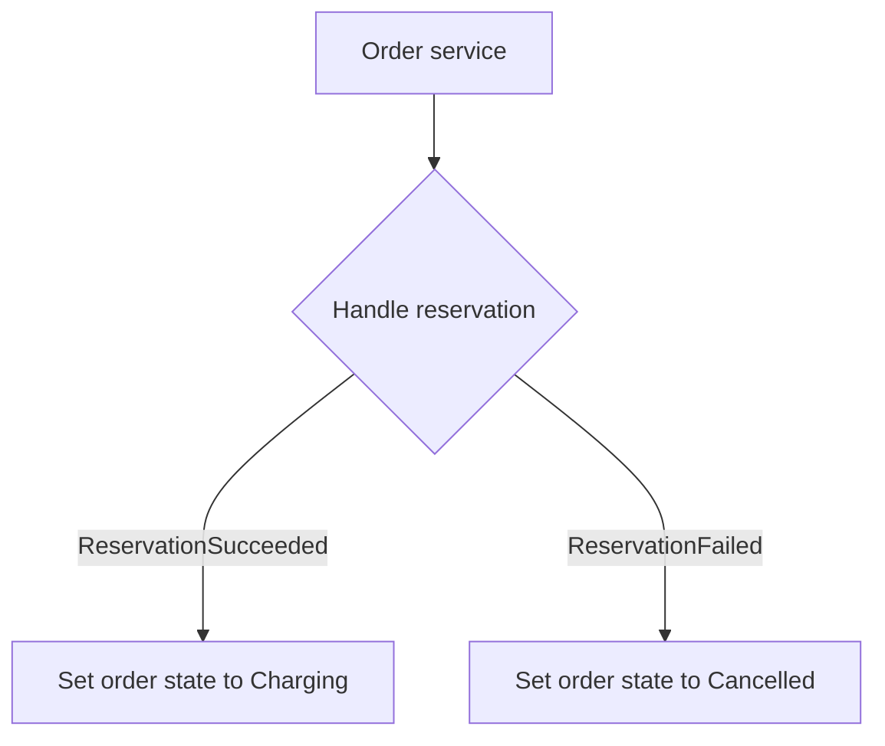
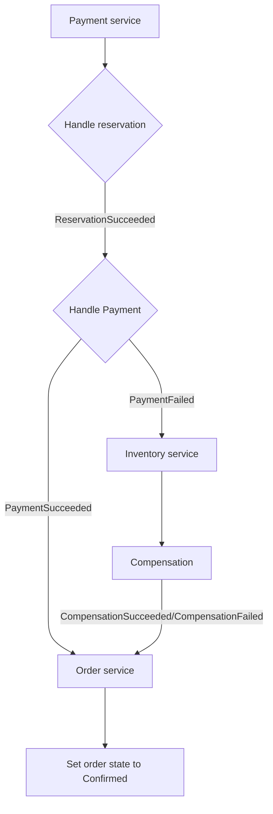
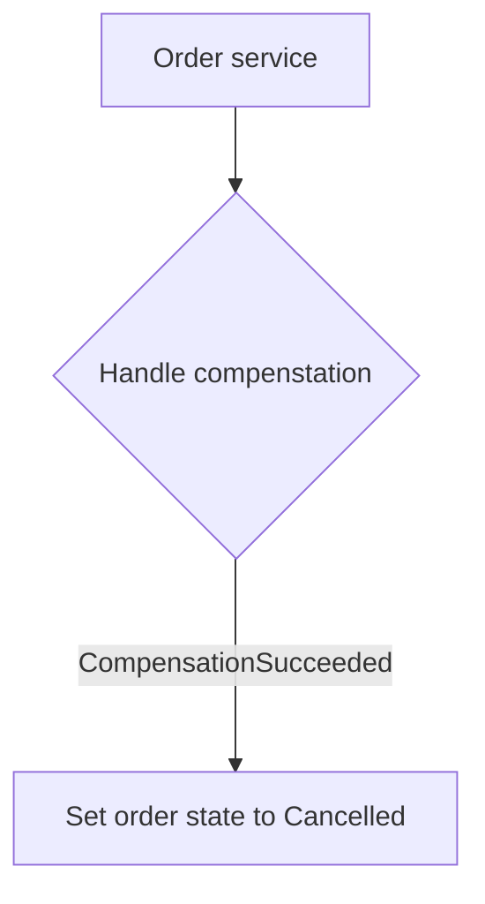

# OrderFlow

Some of my challenges!

## Workflow

1.

```mermaid
flowchart TD
    orderService[Order service] --> createOrder[Create order]
    createOrder ---> setOrderStateToPending[Set order state to Pending]
    setOrderStateToPending --->|OrderPlaced| inventoryService[Inventory service]
    inventoryService ---> handleReservation[Handle reservation]
    handleReservation --->|ReservationSucceeded/ReservationFailed| subscriber[Order, Payment service]
```

2.

```mermaid
flowchart TD
    orderService[Order service] --> handleReservation{Handle reservation}
    handleReservation --->|ReservationSucceeded| setOrderstateToCharging[Set order state to Charging]
    handleReservation --->|ReservationFailed| setOrderstateToCancelled[Set order state to Cancelled]
```

3.

```mermaid
flowchart TD
    paymentService[Payment service] --> handleReservation{Handle reservation}
    handleReservation ---> |ReservationSucceeded| handlePayment{Handle Payment}
    handlePayment --->|PaymentSucceeded| orderService[Order service]
    orderService ---> setOrderStateToConfirmed[Set order state to Confirmed]
    handlePayment --->|PaymentFailed| inventoryService[Inventory service]
    inventoryService ---> compensation[Compensation]
    compensation --->|CompensationSucceeded/CompensationFailed| orderService
```

4.

```mermaid
flowchart TD
    orderService[Order service] --> handleCompensation{Handle compenstation}
    handleCompensation --->|CompensationSucceeded| setOrderstateToCancelled[Set order state to Cancelled]
```
